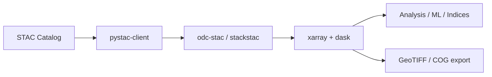

# eo-stac 🌍🛰️

**eo-stac** is a practical, hands-on repository for working with **Earth Observation (EO) data using STAC (SpatioTemporal Asset Catalogs)**.
It focuses on **cloud-native, authentication-light workflows** using modern Python tools such as **pystac-client, odc-stac, stackstac, xarray, and dask**.

This repo is designed for **researchers, students, and practitioners** who want to:

* Discover EO datasets via STAC
* Load data lazily (no bulk downloads)
* Work efficiently with Sentinel-1, Sentinel-2, Landsat, and more
* Build reproducible EO + ML workflows

---

## ✨ Key Features

* 🔎 **STAC discovery** using public and semi-public catalogs
* ☁️ **Cloud-native access** (COGs, lazy loading, HTTP range requests)
* 🧠 **Analysis-ready data cubes** with xarray
* ⚡ **Scalable workflows** using Dask
* 📊 **Visualization-ready examples** for Jupyter Notebooks
* 🔓 Focus on **open data sources (no-auth where possible)**

---

## 📦 Covered Data Sources

* **AWS Earth Search (Element84)** – Sentinel-1, Sentinel-2, Landsat (no auth)
* **Microsoft Planetary Computer** – Signed but frictionless access
* **Copernicus Data Space (CDSE)** – Sentinel-1 / Sentinel-2 (auth required)
* **NASA / USGS STAC endpoints** (where applicable)

> ⚠️ The repository intentionally avoids workflows that require heavy platform lock-in (e.g. Google Earth Engine), unless explicitly stated.

---

## 🛠️ Core Python Stack

```text
pystac-client   – STAC discovery and search
odc-stac        – EO-friendly STAC → xarray loading
stackstac       – Fast stacking of COG-based EO data
xarray          – N-dimensional labeled arrays
dask            – Parallel & lazy computation
rioxarray       – Raster I/O (GeoTIFF, COG)
matplotlib      – Visualization
```

---

## 🚀 Typical Workflow



---

## 📓 Example Use Cases

* Sentinel-2 NDVI / EVI computation
* Sentinel-1 VV/VH backscatter analysis
* SAR–optical data fusion
* Time-series extraction for ML models
* Crop monitoring & agricultural indicators
* Reproducible Jupyter-based EO tutorials

---

## 📁 Repository Structure

```text
eo-stac/
├── notebooks/        # Jupyter notebooks (STAC → analysis)
├── scripts/          # Reusable Python scripts
├── examples/         # Minimal working examples
├── environment.yml   # Conda environment
├── requirements.txt  # pip requirements
└── README.md
```

*(Structure may evolve as new examples are added.)*

---

## 🧪 Getting Started

### 1️⃣ Clone the repository

```bash
git clone https://github.com/geonextgis/eo-stac.git
cd eo-stac
```

### 2️⃣ Create a Python environment

**Using conda:**

```bash
conda env create -f environment.yml
conda activate eo-stac
```

**Or using pip:**

```bash
pip install -r requirements.txt
```

### 3️⃣ Launch Jupyter

```bash
jupyter lab
```

---

## 🔐 Authentication Notes

* **No authentication required** for:

  * AWS Earth Search
  * Most Planetary Computer workflows

* **Authentication required** for:

  * Copernicus Data Space (CDSE)
  * openEO backends

Authentication examples are clearly marked in the notebooks.

---

## 📘 Intended Audience

* EO / Remote Sensing researchers
* Geospatial data scientists
* ML practitioners working with raster data
* Students learning modern EO pipelines
* Anyone moving from *download-first* to *cloud-native* EO

---

## 🧭 Design Philosophy

> **Don’t download first. Don’t authenticate unless you must. Don’t compute until needed.**

This repository promotes:

* Lazy evaluation
* Minimal data movement
* Transparent, inspectable workflows

---

## 🤝 Contributing

Contributions are welcome!

You can help by:

* Adding new STAC examples
* Improving documentation
* Fixing bugs or updating APIs
* Sharing best practices

Please open an issue or pull request.

---

## 📜 License

This repository is released under the **MIT License**.

---

⭐ If you find this repo useful, consider starring it!
